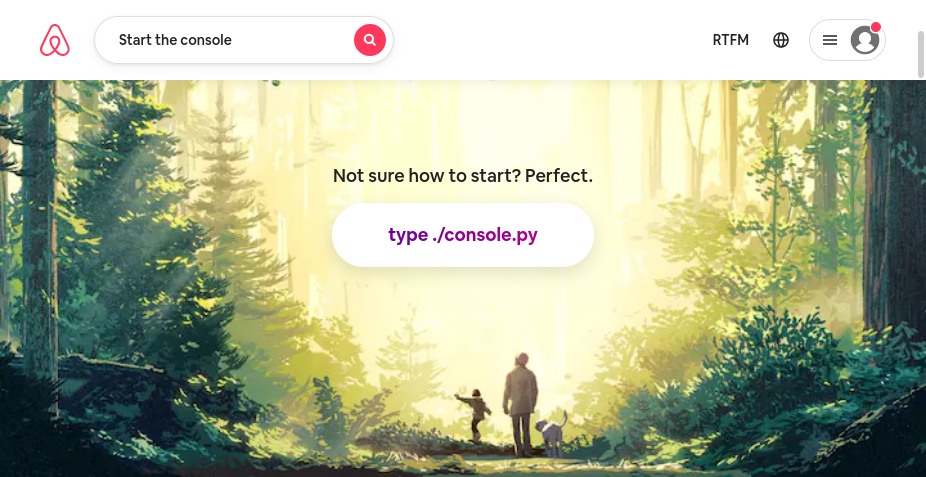

# 0x00. AirBnB clone - The console

`Release date: Nov-15-2021`
<!-- share on twitter -->
[](https://twitter.com/intent/tweet?text=Wow:&url=https%3A%2F%2Fgithub.com%2Fralexrivero%2FAirBnB_clone)



## 0x00.Table of contents

* [0x01 Introduction](#0x01-Introduction)
* [0x02 Environment](#0x02-Environment)
* [0x03 Installation](#0x03-Installation)
* [0x04 Testing](#0x04-Testing)
* [0x05 Usage](#0x05-Usage)
* [0x06 License](#0x06-License)
* [0x07 Contributing](#0x07-Contributing)
* [0x08 Todo](#0x08-Todo)
* [0x09 Changelog](#0x09-Changelog)
* [0x0A Tests](#0x0A-Tests)
* [0x0B Questions](#0x0B-Questions)
* [0x0C Conclusion](#0x0C-Conclusion)
* [0x0D References](#0x0D-References)
* [0x0E Acknowledgements](#0x0E-Acknowledgements)
* [0x0F History](#0x0F-History)
* [0x10 Credits](#0x10-Credits)

## 0x01 Introduction

Team project to build a clone of [AirBnB](https://www.airbnb.com/).

The console is a command interpreter to manage objects abstraction between objects and how they are stored.

To see the fundamental background of the project visit the [Wiki](https://github.com/ralexrivero/AirBnB_clone/wiki).

The console willl perform the following tasks:

* create a new object
* retrive an object from a file
* do operations on objects
* destroy an object

`BaseModel`

## 0x02 Environment

<!-- ubuntu -->
<a href="https://ubuntu.com/" target="_blank"> </a> <!-- bash --> <a href="https://www.gnu.org/software/bash/" target="_blank"> </a> <!-- python--> <a href="https://www.python.org" target="_blank"> </a> </a> <!-- vim --> <a href="https://www.vim.org/" target="_blank"> </a> <!-- vs code --> <a href="https://code.visualstudio.com/" target="_blank"> </a> </a><!-- git --> <a href="https://git-scm.com/" target="_blank"> </a> <!-- github --> <a href="https://github.com" target="_blank"> </a>
 <!-- Style guidelines -->
* Style guidelines:
  * [pycodestyle (version 2.7.*)](https://pypi.org/project/pycodestyle/)
  * [PEP8](https://pep8.org/)

All the development and testing was runned over an operating system Ubuntu 20.04 LTS using programming language Python 3.8.3. The editors used were VIM 8.1.2269, VSCode 1.6.1 and Atom 1.58.0 . Control version using Git 2.25.1.

## 0x03 Installation

```bash
git clone https://github.com/ralexrivero/AirBnB_clone.git
```

change to the `AirBnb` directory and run the command:

```bash
 ./console.py
```

### Execution

In interactive mode

```bash
$ ./console.py
(hbnb) help

Documented commands (type help <topic>):
========================================
EOF  help  quit

(hbnb) 
(hbnb) 
(hbnb) quit
$
```

in Non-interactive mode

```bash
$ echo "help" | ./console.py
(hbnb)

Documented commands (type help <topic>):
========================================
EOF  help  quit
(hbnb) 
$
$ cat test_help
help
$
$ cat test_help | ./console.py
(hbnb)

Documented commands (type help <topic>):
========================================
EOF  help  quit
(hbnb) 
$
```

## 0x04 Testing

### Documentation

* Modules:

```python
python3 -c 'print(__import__("my_module").__doc__)'
```

* Classes:

```python
python3 -c 'print(__import__("my_module").MyClass.__doc__)'
```

* Functions (inside and outside a class):

```python
python3 -c 'print(__import__("my_module").my_function.__doc__)'
```

and

```python
python3 -c 'print(__import__("my_module").MyClass.my_function.__doc__)'
```

### Python Unit Tests

* unittest module
* File extension ``` .py ```
* Files and folders star with ```test_```
* Organization:for ```models/base.py```, unit tests in: ```tests/test_models/test_base.py```
* Execution command: ```python3 -m unittest discover tests```
* or: ```python3 -m unittest tests/test_models/test_base.py```

### run test in interactive mode

```bash
echo "python3 -m unittest discover tests" | bash
```

## 0x05 Usage

* Start the console in interactive mode:

```bash
$ ./console.py
(hbnb)
```

* Use help to see the available commands:

```bash
(hbnb) help

Documented commands (type help <topic>):
========================================
EOF  all  count  create  destroy  help  quit  show  update

(hbnb) 
```

* Quit the console:
```bash
(hbnb) quit
$
```

## 0x06 License

This project is under the Apache 2.0 license.

## 0x07 Contributing

This is a team project for practice and learning purposes. Contribution is welcome and encouraged.

## 0x08 Todo

## 0x09 Changelog

## 0x0A Tests

## 0x0B Questions

## 0x0C Conclusion

## 0x0D References

https://www.w3schools.com/python/python_modules.asp
https://docs.python.org/3.4/tutorial/modules.html#packages
https://docs.python.org/3/library/unittest.html
https://developers.google.com/edu/python

## 0x0E Acknowledgements

## 0x0F History

## 0x10 Credits

Rodrigo

<a href="https://www.linkedin.com/in/rodrigo-mato-pla/" target="_blank">   </a>

<a href="https://github.com/RodrigoMato00/" target="_blank">   </a>

<br/>
<br/>

Ronald

<a href="https://twitter.com/ralex_uy" target="_blank">   </a>

<a href="https://www.linkedin.com/in/ronald-rivero/" target="_blank">   </a>

<a href="https://github.com/ralexrivero/" target="_blank">   </a>

<br/>
